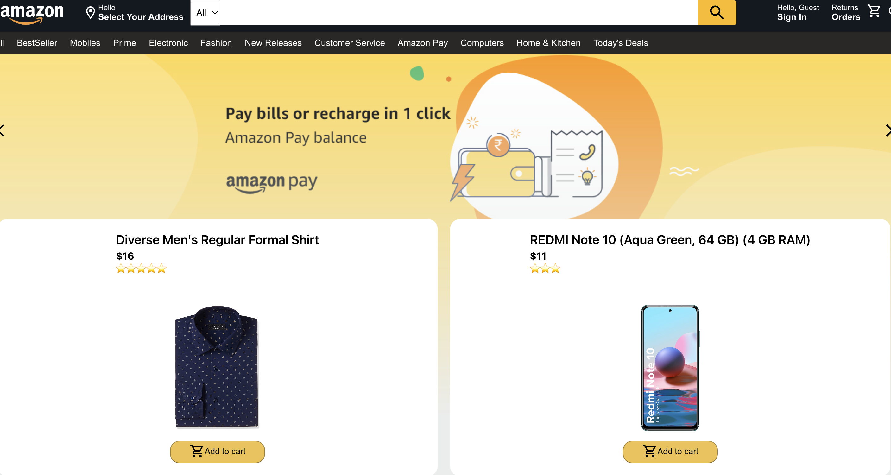
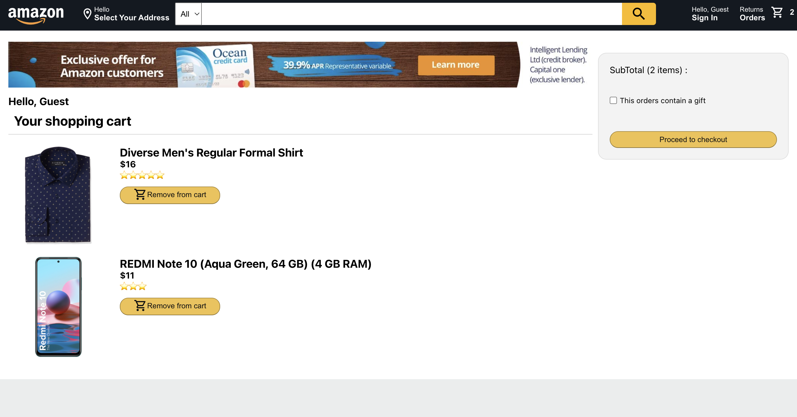

# Amazon Clone

• Created an Amazon clone website with features such as user sign-up/sign-in, product pages and shopping cart.

• User account creation and authentication are implemented using Google Firebase Authentication and deployed the application to Firebase Hosting service.

## Project link:

https://project--clone-31693.web.app

## Technologies used:

1. ReactJS
2. Firebase
3. Redux

## Steps to run:

1. Clone the repository.
2. cd src && && npm install && npm run start.
